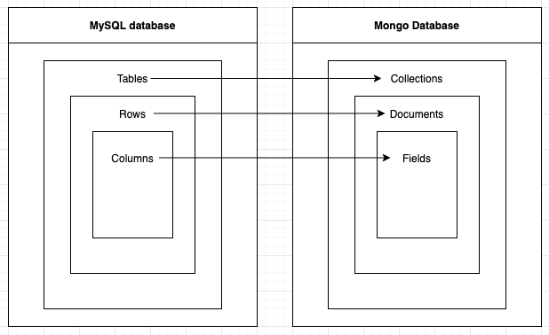
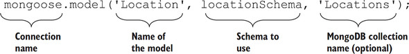
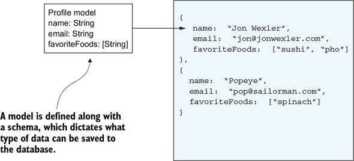
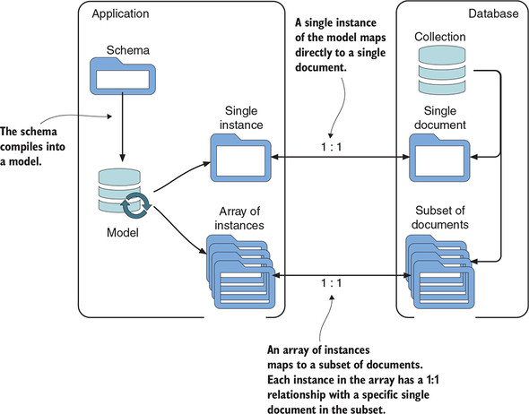
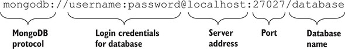
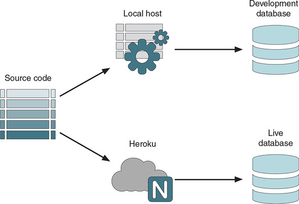
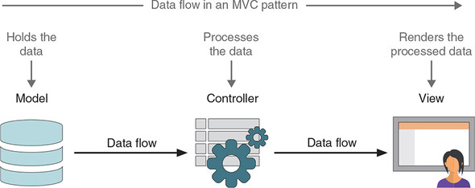
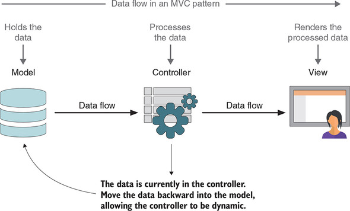

### Outline

- Mongoose
  - schemas vs models
  - Model vs document
  - Connection
- MVC

---

### MongoDB vs SQL

---

### Mongoose

---

### Collections, documents, schemas, and paths

---

### Schemas vs models

- [metaphor](https://www.geeksforgeeks.org/difference-between-class-and-object/)

---

### Compiling Mongoose schemas into models

---

### Model vs document

---

### Model vs document ...

> A single instance of a model has a one-to-one relationship with a single document in the database.
> 

---

### connection

---

### connection ...

- `return note.save()`

---

### Schema types, validation

- String, Number, Date, Array, Mixed, Boolean, ObjectId (not \_id)
- validation: required fields e.g. `required: true`

---

### Different environments

---

### MVC

---

### MVC ...

---

### Reference

- Getting MEAN with Mongo, Express, Angular, and Node, Second Edition by Simon Holmes, clive harber
